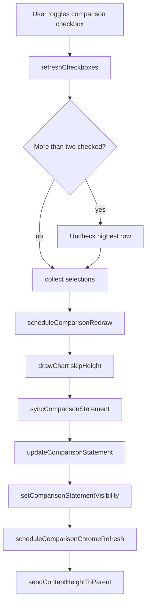
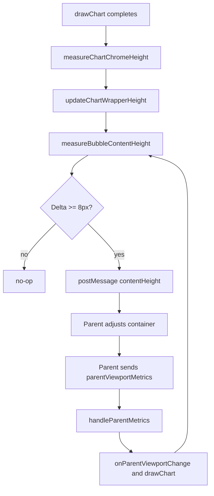

# Comparison Cards & Parent Height Negotiation

This note explains how the comparison cards ("c-cards") switch between active and inactive states, how the embedded experience negotiates height with its parent, and why the bubble chart often renders twice after each comparison change.

## c-card activation lifecycle

1. **Checkbox instrumentation** – When category rows are rebuilt, `refreshButtons()` injects a `label.comparison-checkbox-wrap` per row once at least two categories exist. It restores previous state, applies URL-provided `initialComparisonFlags`, and defaults the first two rows to checked status. See [bubblechart/main.js#L2142-L2230](bubblechart/main.js#L2142-L2230).
2. **Two-check maximum** – `refreshCheckboxes()` enforces that only two `.comparison-checkbox` inputs can be checked simultaneously. Extra checks are cleared from the highest (top-most) checked row in DOM order while keeping the user-triggered box sticky. Whenever a user change occurs, it schedules `scheduleComparisonRedraw('comparison-checkbox')` so the data/state stay in sync. Even if two inputs are auto-checked, c-cards remain hidden until both checked rows resolve to real categories with data. See [bubblechart/main.js#L2242-L2310](bubblechart/main.js#L2242-L2310).
3. **Selection harvest** – `getComparisonSelections()` walks the category rows, pairing the checked inputs with each row’s `<select>` value to produce up to two display names. See [bubblechart/main.js#L2312-L2331](bubblechart/main.js#L2312-L2331).
4. **Statement sync** – Every `drawChart()` call invokes `syncComparisonStatement()` before rendering. It maps the two selected names back to Supabase category records, enriches each record with scatter data (pollution, activity, emission factor), and derives:
   - `leftLeader`/`leftFollower` for emissions,
   - `energyLeader`/`energyFollower` for activity,
   - ratios, warning calculations, and tooltip payloads.
  If fewer than two selections or datapoints exist, it calls `hideComparisonStatement()` so placeholder defaults never surface as cards. See [bubblechart/main.js#L2334-L2700](bubblechart/main.js#L2334-L2700).
5. **Rendering & measurement** – `updateComparisonStatement()` builds the two c-card DOM blocks plus the warning ribbon, injects detailed tooltips, and writes the markup to `#comparisonDiv`. Before committing the markup it calls `updateComparisonMeasurement()` to render the same HTML inside an off-screen measuring div so it knows exactly how many pixels of “chrome” the cards will require. See [bubblechart/main.js#L3100-L3530](bubblechart/main.js#L3100-L3530) and the measurement helpers at [bubblechart/main.js#L472-L566](bubblechart/main.js#L472-L566).
6. **Visibility toggles** – When markup is added the code calls `setComparisonStatementVisibility(true, …)` to flip the `comparisonStatementVisible` flag, mark `pendingComparisonChromeHeight`, suppress the wrapper observer for 450 ms, and queue a chrome refresh via `scheduleComparisonChromeRefresh()`. If prerequisites fail later on, `hideComparisonStatement()` reverses those steps and zeroes the cached measurement so the parent can shrink again. See [bubblechart/main.js#L3128-L3212](bubblechart/main.js#L3128-L3212) and [bubblechart/main.js#L3532-L3558](bubblechart/main.js#L3532-L3558).

## Parent height negotiation pipeline

1. **Bootstrap** – The iframe instantiates `LayoutHeightManager.create({ namespace: 'bubble', … })` so it can estimate the minimum chart canvas size, clamp `.chart-wrapper` heights, and respond to parent metrics. See [bubblechart/main.js#L101-L139](bubblechart/main.js#L101-L139) and [SharedResources/layout-height-manager.js#L1-L220](SharedResources/layout-height-manager.js#L1-L220).
2. **Consuming parent metrics** – The iframe listens for `message` events of type `parentViewportMetrics`, pushes them through `layoutHeightManager.handleParentMetrics()`, and updates CSS custom properties (`--bubble-footer-height`, `--bubble-viewport-height`) so it mirrors the available space inside the parent shell. See [bubblechart/main.js#L205-L320](bubblechart/main.js#L205-L320).
3. **Chrome estimation** – Every draw (or parent resize) calls `measureChartChromeHeight()`, which sums the title, legend, and current comparison card height. If the new cards are still rendering, `pendingComparisonChromeHeight` uses the off-screen measurement as a prediction. See [bubblechart/main.js#L520-L566](bubblechart/main.js#L520-L566).
4. **Wrapper sizing** – `updateChartWrapperHeight()` hands the viewport height, footer reserve, and chrome buffer to `layoutHeightManager.estimateChartHeight()` so `.chart-wrapper` is clamped to at least 420 px and there is breathing room above the footer. The result is cached in `window.__BUBBLE_PRE_LEGEND_ESTIMATE`. See [bubblechart/main.js#L566-L640](bubblechart/main.js#L566-L640) and [SharedResources/layout-height-manager.js#L51-L160](SharedResources/layout-height-manager.js#L51-L160).
5. **Document measurement** – After each render `measureBubbleContentHeight()` samples multiple DOM bottoms (shell, mainContent, wrapper, tutorial overlay) and falls back to the document height to decide how tall the iframe truly is. This guards against CSS transitions and overlays that temporarily extend the page. See [bubblechart/main.js#L1504-L1606](bubblechart/main.js#L1504-L1606).
6. **Parent notification loop** – `sendContentHeightToParent()` posts `{ type: 'contentHeight', chart: 'bubble', height }` when the measured value changes by ≥ 8 px. The parent reacts by resizing the host container and sending a fresh `parentViewportMetrics` message; that, in turn, triggers `layoutHeightManager.onParentViewportChange` → `drawChart(true)` → another `sendContentHeightToParent()`. See [bubblechart/main.js#L1608-L1670](bubblechart/main.js#L1608-L1670) and the change handler at [bubblechart/main.js#L250-L276](bubblechart/main.js#L250-L276).

## Why the chart renders twice + mitigation ideas

- **First render (intentional)** – User-driven state changes (`yearSelect`, `pollutantSelect`, category swaps, or comparison checkbox toggles) call `updateChart()` → `drawChart()`. When the trigger is a comparison toggle the redraw is scheduled inside `scheduleComparisonRedraw()` so it always runs once with `skipHeightUpdate = true`. See [bubblechart/main.js#L2800-L3040](bubblechart/main.js#L2800-L3040).
- **Second render (feedback loop)** – The newly injected c-card markup changes `.chart-wrapper` height, so either:
  1. `layoutHeightManager.observeWrapper()` fires after its debounce window and calls `drawChart(true)` even though the data already matches the UI, or
  2. the parent resizes the iframe in response to `contentHeight`, causing `layoutHeightManager.onParentViewportChange()` to call `drawChart(true)` again. Both routes end with an identical render, just to recalc heights. See [bubblechart/main.js#L2874-L2915](bubblechart/main.js#L2874-L2915) and [bubblechart/main.js#L250-L276](bubblechart/main.js#L250-L276).
- **Suppression helps but is time-limited** – `suppressWrapperHeightObserver()` tries to mute the observer for 450 ms whenever the cards toggle, yet large DOM shifts (fonts loading, tooltips expanding) may still occur later and re-trigger the observer. Similarly, parent viewport changes are debounced but not ignored, so every iframe resize from the shell will request another draw.

### Ways to reduce duplicate renders

1. **Gate the observer callback** – Extend `shouldIgnoreWrapperObserverTick()` so it also checks whether the last redraw already ran with identical `selectedYear/pollutant/categories` and the new height delta is below a larger guard (e.g., 40 px). Skip the redraw when only comparison chrome changed.
2. **Short-circuit parent change handler** – Before calling `drawChart(true)` inside `layoutHeightManager.onParentViewportChange`, compare the incoming viewport height with `window.__BUBBLE_PRE_LEGEND_ESTIMATE`. If the delta is below `MIN_HEIGHT_DELTA`, only run `sendContentHeightToParent(true)` instead of a full redraw.
3. **Cache post-comparison renders** – Record a hash of the last `syncComparisonStatement()` payload and reuse it until the comparison selections or pollutant/year actually change. That allows the observer-triggered draw to exit early because `pendingComparisonChromeHeight` is already zero and the chart data is unchanged.
4. **Defer measurement to renderer** – An alternative is to let `ChartRenderer` expose its canvas height and pass that back to `layoutHeightManager.ensureWrapperCapacity()` without a second `drawBubbleChart`. That way the observer can stop forcing a fresh render—the wrapper would already know its final size.

Taken together, the code already limits most redundant work, but the extra render happens whenever height changes propagate back from the parent or from the resize observer. Tightening those guardrails (options 1–3) typically removes the second render without sacrificing responsive sizing.
